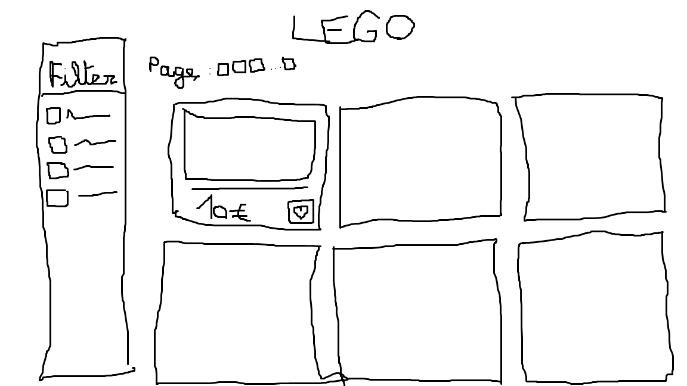

# Design Review

## Low-fidelity sketches

## List of taken considerations for sketches/design
- Lisibilité des informations principales (image, titre, prix) dès le premier coup d'œil.
- Navigation claire avec une sidebar dédiée aux filtres.
- Icônes et interactions visuelles pour une utilisation intuitive.

## Main problem we are solving for
Permettre aux utilisateurs de trouver rapidement les meilleures offres LEGO parmi une grande quantité de données.

## Measures of the success
Un utilisateur peut filtrer, trier et accéder aux produits facilement.
Succès mesuré par le nombre de clics, l’usage des favoris, le temps passé sur la page.

## List of visual aspects convictions
- Layout en colonnes (sidebar + contenu central).
- Espacement suffisant des élements.
- Couleurs neutres avec accents bleus pour les actions.
- Police sans-serif pour lisibilité.

## List of interaction patterns convictions
- Checkboxes pour les filtres multiples.
- Bouton cœur cliquable pour gérer les favoris.
- Couleur différente pour l’état actif/inactif des filtres.